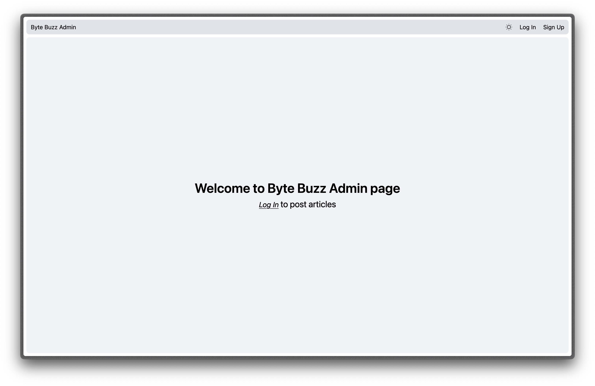
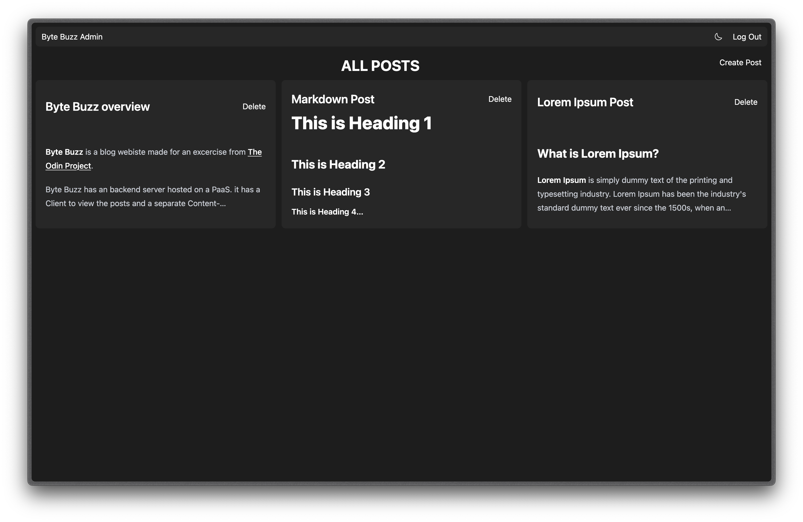

<h3 align="center">Byte Buzz Admin</h3>

  

    Byte Buzz Admin is a tool to manage the contents of the your blog. You can Create and Delete articles of your blog. This is created using React and Javascript with RESTful APIs created in Express server and it uses JSON Web Token for Authentication, React Router, React-Hook_Form, Zod, Axios, TinyMCE, DOMPurify under the hood.
     
    <a href="https://byte-buzz-admin-2x3wqz11g-santhoshs-projects-9db4bd78.vercel.app/" target="_blank">Live Demo</a>
  

 

<!-- ABOUT THE PROJECT -->

### Preview

 
 

### API

The CMS fetches data from RESTful blog API. The source code for the API can be found at <a href="https://github.com/notsanta20/byte_buzz_api" target="_blank">Byte Buzz API</a>

### CLIENT

The Client has can accessed from here <a href="https://github.com/notsanta20/byte_buzz_client" target="_blank">Byte Buzz Client</a>

### Built With

<!-- ACKNOWLEDGMENTS -->

## Acknowledgments

- Inspiration by <a href="https://www.theodinproject.com/lessons/node-path-nodejs-blog-api" target="_blank">The Odin Project</a>
